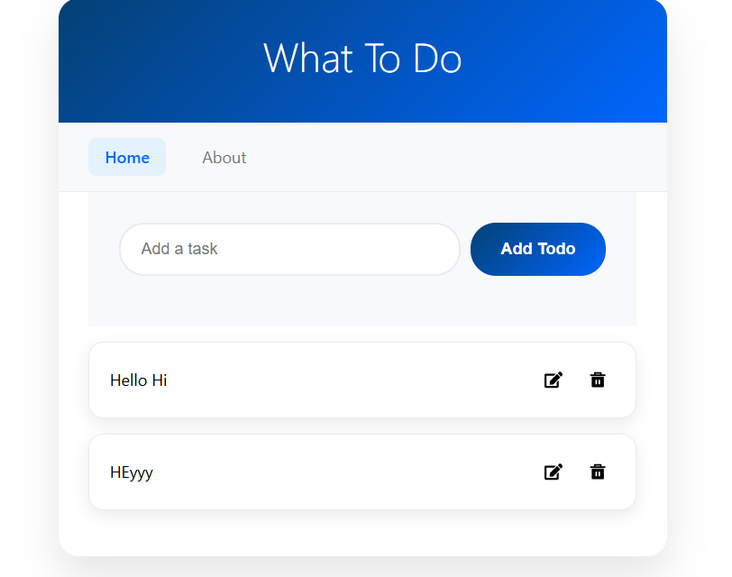

# Todo List React App

A simple todo list application built with React, TypeScript, and Vite.

## Features
- Add tasks
- Edit tasks
- Delete tasks
- Saves tasks in your browser (localStorage)

## Screenshots 

## Run
1. Clone or download this repository.
2. Install dependencies: `npm install`
3. Start the development server: `npm run dev`
4. Open your browser to the URL shown in the terminal (usually `http://localhost:5173`).

